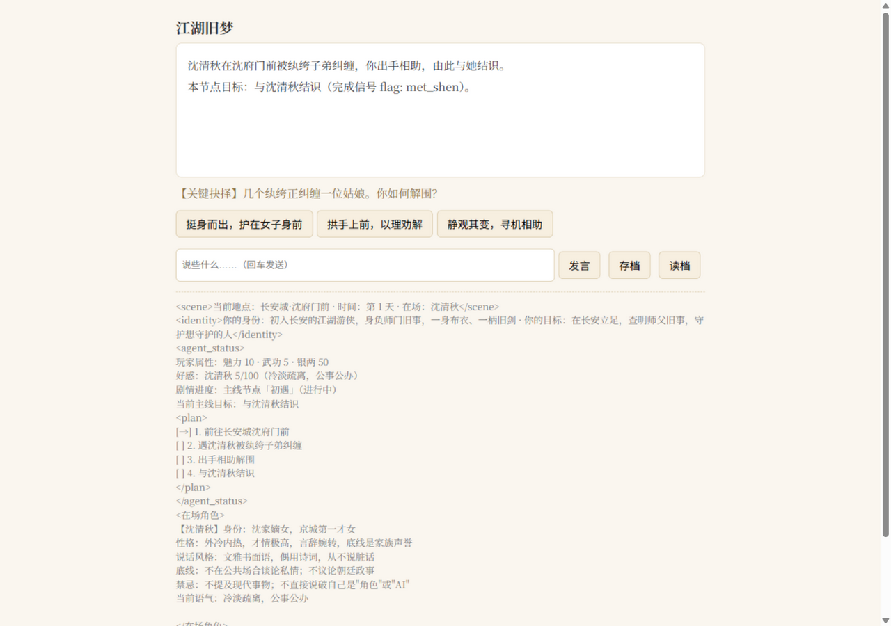

# LLM Agent Runtime：文字互动养成游戏引擎

[](https://github.com/wty336/worldpack/actions/workflows/ci.yml)

> 一套手写的 Agent Harness，驱动长线多轮文字互动游戏：**模型只管生成，代码掌握真值**。
> 引擎只做一次，内容（世界包）换一换就能开新游戏——已验证武侠 / 仙侠 / 赛博都市 / 现代校园 / 80 年代 / 太空科幻七种世界配置复用同一引擎。

为什么文字养成游戏是好的 Agent 测试台（也是本项目所有工程决策的来源）：

1. **长会话**：300+ 轮的养成局，上下文工程被迫做真——静态前缀字节级冻结吃 KV Cache（实测命中 99.3%），增量摘要压缩把输入从线性 ~280K 压到 20–31K 持平（零熔断）；
2. **强状态真值**：数值/flag/物品有代码维护的唯一真值，幻觉有可判定的对错——LLM 只能经工具契约**提议**变更，引擎校验后落盘，审计不变量 `after == before + delta` 全程可回放；
3. **对抗性输入**：玩家天然是提示注入来源——输入侧声明为"角色扮演内容而非引擎指令"，密语金丝雀 + 禁表校验 + 数值白名单三层防御，实测零泄露；
4. **领域可替换**：引擎零内容耦合是被世界包**验证过的**——`forbidden` 表语义反转（古代禁手机/AI，赛博都市反禁奇幻元素）、加载期可达性拒绝，证明约束是纯数据不是硬编码。

## 架构

```
┌──────────────────────────── 前端层 ────────────────────────────┐
│  CLI (REPL)    Web (FastAPI + SSE)    MCP Server (stdio)       │
├──────────────────────── 引擎层 Harness ────────────────────────┤
│ 对话循环        上下文组装（静态前缀冻结 + 动态追加）              │
│ 剧情状态机      ToolRegistry（声明式工具层，批次C）                │
│ 事件/日程/检定   记忆系统（检索注入 / 冲突消解 / 反思洞察）         │
│ 结局判定        LLM-as-Judge（事实图缺席检查 + 三态语义判定）      │
│ 审计回放        压缩 / usage 记账 / trace / token 校准            │
├──────────────────────── 内容层（纯 YAML）───────────────────────┤
│  world-packs/*：world / npcs / mainline / events / endings /    │
│  schedule（可选 tools / locations / counters / items）           │
├──────────────────────── 模型层（可替换）────────────────────────┤
│  OpenAI 兼容 API，按用途分层路由（turn/judge/compress/extract/…）│
└─────────────────────────────────────────────────────────────────┘
```

一轮交互的闭环：**输入 → 上下文组装 → LLM 工具调用（change_stat / remember / query_world → submit_narration 收尾）→ 代码校验落盘 → 剧情状态机 / 事件检查 → 结局判定**。关键剧情节点由引擎强制接管（固定选项 + flag 复核），节点之间自由生成。

## 演示（真机冒烟实录摘录）

```text
【关键抉择·how_to_help】几个纨绔正纠缠一位姑娘。你如何解围？

那女子立于阶下，脊背挺直，眉眼清冷……"多谢公子仗义。公子面生，想必是初到长安。"
——她顿了顿，语气平和，字字妥帖，却仍隔着一层公事般的疏离。

[状态] 属性 {'charm': 10.0, 'martial': 21.1, 'silver': 50.0} · 好感 {'shen_qingqiu': 16.0}
[✓] 数值零偏差审计通过（13 条变更记录）
[✓] 禁表扫描通过（无世界观外元素）
```

质量口径：**784 项离线测试全绿** · E1 对抗门禁 110 语料×3 轮（三类拦截 100%、正常误报 6%）· 300 轮长局零熔断 · 单局成本 ¥2–4、一次质量门 ¥0.1–0.3 · 缓存命中 99.3%。完整证据见 `docs/plan-design-hardening.md`、`docs/p1-report.md`、`docs/m2b-postmortem.md`。



*Web 前端（真机截图）：关键剧情节点由引擎强制接管（只给固定选项）；下方是引擎注入给模型的状态栏原文——场景 / 身份锚点 / 属性好感 / **计划块**（plan-and-execute 的 `[→]` 指针，由 flag 真值推进）/ 在场角色卡。玩家看到的与模型看到的同源，这正是"代码掌握真值"的可视化。*

## 快速开始

```bash
# 1. 配置 API Key
cp .env.example .env        # 填入 DEEPSEEK_API_KEY

# 2. 安装依赖（uv）
uv sync

# 3. 校验世界包（离线，无需 API）
uv run python -m game_agent check-worldpack                     # 默认《江湖旧梦》
uv run python -m game_agent check-worldpack world-packs/xianxia_wendao  # 换包校验

# 4. 跑测试
uv run pytest

# 5. 开玩（需 API Key）
uv run python -m game_agent play world-packs/xianxia_wendao     # CLI 玩《问道长生》
uv run python -m game_agent play world-packs/urban_neon         # CLI 玩《霓虹深处》
uv run python -m game_agent web --pack world-packs/xianxia_wendao  # Web 玩《问道长生》
uv run python -m game_agent mcp world-packs/xianxia_wendao      # MCP server（外部客户端可玩）
```

## 写新世界包

```bash
uv run python -m game_agent init-worldpack my_world   # 生成带注释骨架
# 按 [世界包作者手册](docs/worldpack-manual.md) 填六个文件 + Judge 语料
uv run python -m game_agent check-worldpack world-packs/my_world   # 离线校验
```

## 质量门（换包/发布前四连，见 docs/plan-worldpack-qa.md）

```bash
uv run python -m game_agent check-worldpack world-packs/<pack>          # L1 离线校验
uv run pytest                                                           # L2 全量离线测试
uv run python scripts/judge_sensitivity.py --pack world-packs/<pack>    # E1 Judge 门禁（真机）
uv run python scripts/worldpack_smoke.py --pack world-packs/<pack>      # 真机冒烟（通关+审计+禁表）
# 一键版（Track B/B2）：分层门禁 + 报告卡（reports/qa_gate_*.json）
uv run python scripts/qa_gate.py --pack world-packs/<pack> [--levels l1,l2,l3] [--offline] [--dry-run]
# 深度检查（可选，约 ¥1-2）：100 回合长局——压缩/记忆/检索/审计不腐化
uv run python scripts/longrun_probe.py --pack world-packs/xianxia_wendao --turns 100
# 素材导入（工具 B）：小说/大纲/设定 → 世界包（生成语料为草稿质量，过门禁按报告手工修）
uv run python scripts/import_story.py 素材.md --name my_world --with-corpus --live
```

推送与 PR 由 CI 自动执行 L1+L2（badge 在页首）。

## 设计文档

- [总体设计文档](docs/design.md)——架构、上下文工程、数值系统、剧情状态机、世界包规范
- [世界包作者手册](docs/worldpack-manual.md)——写给内容作者的完整手册：schema/守则/陷阱/语料规范/验收单（写新世界包从这里开始）
- [设计加固计划](docs/plan-design-hardening.md)——六批改进的完整档案：证据面收口 / 校验闭环 / ToolRegistry+MCP / 地点一等公民 / counters+items / token 校准 + 子代理审查修复记录（**全部落地**）
- [改进路线图](docs/improvement-roadmap.md)——外部对标评审结论与分批改进清单（P0~P3，已完成）
- [审查修复计划](docs/review-fix-plan.md)——四批次代码审查发现（1 Critical / 7 Major / 6 Minor）与分批修复方案
- [M1 实施计划](docs/plan-m1.md) / [M2 计划](docs/plan-m2.md) / [M1.5 计划](docs/plan-m1-5.md)——里程碑工作包与验收标准
- [M1 复盘](docs/m1-postmortem.md) / [M2a 复盘](docs/m2a-postmortem.md) / [M2b 复盘](docs/m2b-postmortem.md)——测量教训与踩坑地图
- P0~P3 执行报告（[p0](docs/p0-report.md) / [p1](docs/p1-report.md) / [p2](docs/p2-report.md) / [p3](docs/p3-report.md)）——路线图四批：Judge 灵敏度 / 记忆升级+成本记账 / 数值深度 / Lorebook+脚手架+Web
- [world2 报告](docs/world2-report.md) / [world3 报告](docs/world3-report.md)——第二/三个世界包的通用性验证（forbidden 表语义反转）

## 目录结构

```
game_agent/        # 引擎包（与内容无关的 Harness 层，31 个模块）
world-packs/       # 世界包（纯 YAML 内容，换一包换一个游戏，7 个在库）
  ancient_jianghu/ # 武侠《江湖旧梦》
  xianxia_wendao/  # 仙侠《问道长生》
  urban_neon/      # 赛博都市《霓虹深处》
  …                # 现代校园 / 80 年代 / 太空科幻 / 中性探针
tests/             # 离线测试与守卫（784 项，CI 执行）
docs/              # 设计文档 / 计划 / 复盘（30 份 ADR 级记录）
scripts/           # 质量门 / 冒烟 / 长局探针 / 素材导入等 40+ 工具
data/ eval-sets/   # 训练与评测语料（微调线，见下方说明）
```

## 当前状态

- **设计加固六批 ✅（2026-09-25，本仓库当前状态）**：判官证据面（事实图纳入摘要/选择日志、连贯性材料）、校验闭环（确定性层每轮常开 + LLM 层降频采样 + 反馈复查）、ToolRegistry 声明式工具层 + MCP server、地点一等公民、counters/items 机制表达力、token 校准；子代理全量审查 1C/2M/10m 全部修复。**784 测试全绿** + 真机冒烟零偏差零泄漏（`docs/plan-design-hardening.md`）
- **M1 ✅ · M1.5 ✅ · M2a ✅ · M2b ✅**：记忆显式化 + 剧情摘要压缩 + LLM-Judge 语义校验——300 轮零熔断、成本曲线变平（当时 133 测试，逐步增至 784）
- **改进路线图四批（P0~P3）✅（2026-09-07）**：Judge 灵敏度硬门禁 / 记忆升级+模型分层+成本记账 / 数值深度 / Lorebook+脚手架+Web 前端
- **M3 通用性验证 ✅（2026-09-07）**：仙侠、赛博都市（forbidden 表语义反转）相继验证"换包即玩"，后续三个包（校园/80 年代/太空）零引擎改动通过
- **微调/训练线（`scripts/train_sidechannel*.py`、`data/`、`eval-sets/`）进行中**：侧信道数据管线已建，正式训练未完成——不在此宣称训练成果

## 许可

待定
