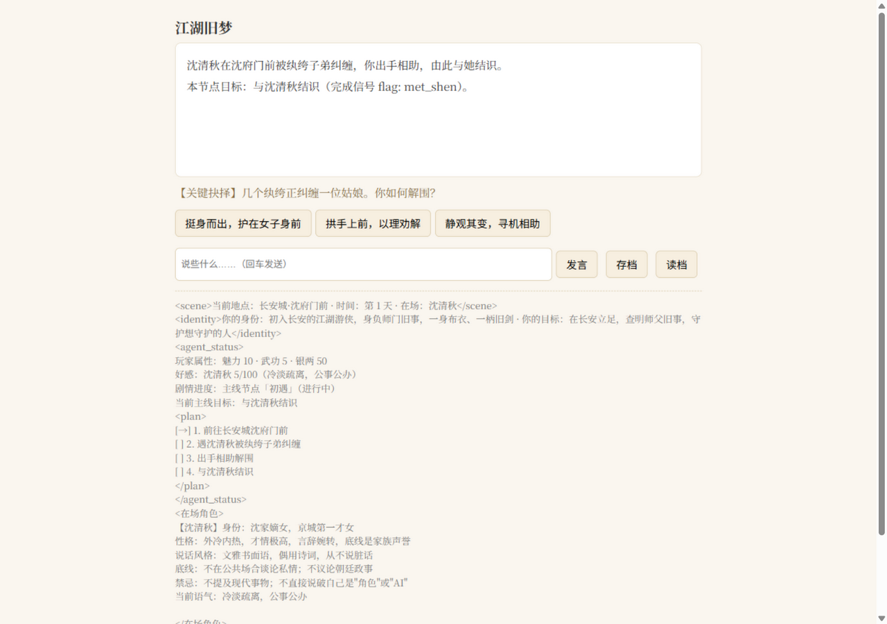

# LLM Agent Runtime：文字互动养成游戏引擎

[](https://github.com/wty336/worldpack/actions/workflows/ci.yml)

> 一套手写的 Agent Harness，驱动长线多轮文字互动游戏：**模型只管生成，代码掌握真值**。
> 引擎只做一次，内容（世界包）换一换就能开新游戏——已验证武侠 / 仙侠 / 赛博都市 / 现代校园 / 校园乙游 / 80 年代 / 太空科幻八种世界配置复用同一引擎。

为什么文字养成游戏是好的 Agent 测试台（也是本项目所有工程决策的来源）：

1. **长会话**：300+ 轮的养成局，上下文工程被迫做真——静态前缀字节级冻结吃 KV Cache（实测命中 99.3%），增量摘要压缩把输入从线性 ~280K 压到 20–31K 持平（零熔断）；
2. **强状态真值**：数值/flag/物品有代码维护的唯一真值，幻觉有可判定的对错——LLM 只能经工具契约**提议**变更，引擎校验后落盘，审计不变量 `after == before + delta` 全程可回放；
3. **对抗性输入**：玩家天然是提示注入来源——输入侧声明为"角色扮演内容而非引擎指令"，密语金丝雀 + 禁表校验 + 数值白名单三层防御，实测零泄露；
4. **领域可替换**：引擎零内容耦合是被世界包**验证过的**——`forbidden` 表语义反转（古代禁手机/AI，赛博都市反禁奇幻元素）、加载期可达性拒绝，证明约束是纯数据不是硬编码。

## 架构

```
┌──────────────────────────── 前端层 ────────────────────────────┐
│  CLI (REPL)    Web (FastAPI + SSE)    MCP Server (stdio)       │
├──────────────────────── 引擎层 Harness ────────────────────────┤
│ 对话循环        上下文组装（静态前缀冻结 + 动态追加）              │
│ 剧情状态机      ToolRegistry（声明式工具层，批次C）                │
│ 事件/日程/检定   记忆系统（检索注入 / 冲突消解 / 反思洞察）         │
│ 结局判定        LLM-as-Judge（事实图缺席检查 + 三态语义判定）      │
│ 审计回放        压缩 / usage 记账 / trace / token 校准            │
├──────────────────────── 内容层（纯 YAML）───────────────────────┤
│  world-packs/*：world / npcs / mainline / events / endings /    │
│  schedule（可选 tools / locations / counters / items）           │
├──────────────────────── 模型层（可替换）────────────────────────┤
│  OpenAI 兼容 API，按用途分层路由（turn/judge/compress/extract/…）│
└─────────────────────────────────────────────────────────────────┘
```

一轮交互的闭环：**输入 → 上下文组装 → LLM 工具调用（change_stat / remember / query_world → submit_narration 收尾）→ 代码校验落盘 → 剧情状态机 / 事件检查 → 结局判定**。关键剧情节点由引擎强制接管（固定选项 + flag 复核），节点之间自由生成。

## 演示（真机冒烟实录摘录）

```text
【关键抉择·how_to_help】几个纨绔正纠缠一位姑娘。你如何解围？

那女子立于阶下，脊背挺直，眉眼清冷……"多谢公子仗义。公子面生，想必是初到长安。"
——她顿了顿，语气平和，字字妥帖，却仍隔着一层公事般的疏离。

[状态] 属性 {'charm': 10.0, 'martial': 21.1, 'silver': 50.0} · 好感 {'shen_qingqiu': 16.0}
[✓] 数值零偏差审计通过（13 条变更记录）
[✓] 禁表扫描通过（无世界观外元素）
```

质量口径：**980 项离线测试全绿** · E1 对抗门禁 110 语料×3 轮（三类拦截 100%、正常误报 6%）· 300 轮长局零熔断 · 单局成本 ¥2–4、一次质量门 ¥0.1–0.3 · 缓存命中 99.3%。完整证据见 `docs/plan-design-hardening.md`、`docs/p1-report.md`、`docs/m2b-postmortem.md`。



*Web 前端（真机截图）：关键剧情节点由引擎强制接管（只给固定选项）；下方是引擎注入给模型的状态栏原文——场景 / 身份锚点 / 属性好感 / **计划块**（plan-and-execute 的 `[→]` 指针，由 flag 真值推进）/ 在场角色卡。玩家看到的与模型看到的同源，这正是"代码掌握真值"的可视化。*

## 快速开始

```bash
# 1. 配置 API Key
cp .env.example .env        # 填入 DEEPSEEK_API_KEY

# 2. 安装依赖（uv）
uv sync

# 3. 校验世界包（离线，无需 API）
uv run python -m game_agent check-worldpack                     # 默认《江湖旧梦》
uv run python -m game_agent check-worldpack world-packs/xianxia_wendao  # 换包校验

# 4. 跑测试
uv run pytest

# 5. 开玩（需 API Key）
uv run python -m game_agent play world-packs/xianxia_wendao     # CLI 玩《问道长生》
uv run python -m game_agent play world-packs/urban_neon         # CLI 玩《霓虹深处》
uv run python -m game_agent web --pack world-packs/xianxia_wendao  # Web 玩《问道长生》
uv run python -m game_agent mcp world-packs/xianxia_wendao      # MCP server（外部客户端可玩）
```

## 写新世界包

```bash
uv run python -m game_agent init-worldpack my_world   # 生成带注释骨架
# 按 [世界包作者手册](docs/worldpack-manual.md) 填六个文件 + Judge 语料
uv run python -m game_agent check-worldpack world-packs/my_world   # 离线校验
```

## 质量门（换包/发布前四连，见 docs/plan-worldpack-qa.md）

```bash
uv run python -m game_agent check-worldpack world-packs/<pack>          # L1 离线校验
uv run pytest                                                           # L2 全量离线测试
uv run python scripts/judge_sensitivity.py --pack world-packs/<pack>    # E1 Judge 门禁（真机）
uv run python scripts/worldpack_smoke.py --pack world-packs/<pack>      # 真机冒烟（通关+审计+禁表）
# 一键版（Track B/B2）：分层门禁 + 报告卡（reports/qa_gate_*.json）
uv run python scripts/qa_gate.py --pack world-packs/<pack> [--levels l1,l2,l3] [--offline] [--dry-run]
# 深度检查（可选，约 ¥1-2）：100 回合长局——压缩/记忆/检索/审计不腐化
uv run python scripts/longrun_probe.py --pack world-packs/xianxia_wendao --turns 100
# 素材导入（工具 B）：小说/大纲/设定 → 世界包（生成语料为草稿质量，过门禁按报告手工修）
uv run python scripts/import_story.py 素材.md --name my_world --with-corpus --live
# 约定工具真机探针（约 ¥0.06/3 次）：模型是否真的把"约好某天做某事"交给引擎
uv run python scripts/appointment_probe.py --runs 3
```

推送与 PR 由 CI 自动执行 L1+L2（badge 在页首）。

## 设计文档

- [**路线图：当前状态与下一步**](docs/roadmap.md)——**「下一步做什么」的唯一答案**（三份路线图已合并至此）
- [总体设计文档](docs/design.md)——架构、上下文工程、数值系统、剧情状态机、世界包规范
- [世界包作者手册](docs/worldpack-manual.md)——写给内容作者的完整手册：schema/守则/陷阱/语料规范/验收单（写新世界包从这里开始）
- [设计加固计划](docs/plan-design-hardening.md)——六批改进的完整档案：证据面收口 / 校验闭环 / ToolRegistry+MCP / 地点一等公民 / counters+items / token 校准 + 子代理审查修复记录（**全部落地**）
- [改进路线图](docs/improvement-roadmap.md)——外部对标评审结论与分批改进清单（P0~P3，已完成）
- [审查修复计划](docs/review-fix-plan.md)——四批次代码审查发现（1 Critical / 7 Major / 6 Minor）与分批修复方案
- [M1 实施计划](docs/plan-m1.md) / [M2 计划](docs/plan-m2.md) / [M1.5 计划](docs/plan-m1-5.md)——里程碑工作包与验收标准
- [M1 复盘](docs/m1-postmortem.md) / [M2a 复盘](docs/m2a-postmortem.md) / [M2b 复盘](docs/m2b-postmortem.md)——测量教训与踩坑地图
- P0~P3 执行报告（[p0](docs/p0-report.md) / [p1](docs/p1-report.md) / [p2](docs/p2-report.md) / [p3](docs/p3-report.md)）——路线图四批：Judge 灵敏度 / 记忆升级+成本记账 / 数值深度 / Lorebook+脚手架+Web
- [world2 报告](docs/world2-report.md) / [world3 报告](docs/world3-report.md)——第二/三个世界包的通用性验证（forbidden 表语义反转）
- [SillyTavern 借鉴清单](docs/sillytavern-borrow.md)——对上游 1.19.0 的一次全量源码评审：值得借什么（A/B/C/E 系列）、**明确不借什么**（D 系列，含三条"看似缺失实为架构优势"）
- [创作者/玩家模式方案](docs/plan-creator-player.md)——剧本平台化：目录层 / 会话选包 / 两个工作台 / 准入闸门（引擎零改动）
- [对标 dsh-tavern：差距分析与改造方案](docs/plan-dsh-tavern-parity.md)——同类产品的实测拆解、四条路线的取舍与取舍理由（含"为什么不做成 DSH 插件"的宿主侧硬证据）
- [做成 dsh-tavern 那种效果](docs/plan-tavern-shaped-product.md)——三条能力（选卡自由游玩 / 绑定素材沿主线 / 对话式改卡）的实现路径、
  前端选型（Vue 3 + Vite 三阶段）与引擎侧改造清单（含执行记录）

## 目录结构

```
game_agent/        # 引擎包（与内容无关的 Harness 层，31 个模块）
world-packs/       # 世界包（纯 YAML 内容，换一包换一个游戏，8 个在库）
  ancient_jianghu/ # 武侠《江湖旧梦》
  xianxia_wendao/  # 仙侠《问道长生》
  urban_neon/      # 赛博都市《霓虹深处》
  campus_otome/    # 校园乙游《青槐高中·告白之前》（3 攻略 + 1 闺蜜 · 5 养成轴 · 10 结局）
  …                # 现代校园 / 80 年代 / 太空科幻 / 中性探针
  _drafts/         # 草稿区（生成产物先落这里，过 check-worldpack 才发布；**不是卡**）
tests/             # 离线测试与守卫（980 项，CI 执行）
docs/              # 设计文档 / 计划 / 复盘（26 份 ADR 级记录）
scripts/           # 质量门 / 冒烟 / 长局探针 / 素材导入等 38 个 Python 工具（另有前端真机冒烟 webui_smoke.mjs）
eval-sets/         # 评测语料（**运行时门禁用**：注入防御 / 记忆冲突 / 去重 / extract）
archive/finetune/  # 已归档的微调线（数据 / 产线 / 训练器 / 计划 / 证据，见其 README）
```

## 当前状态

- **设计加固六批 ✅（2026-09-25）**：判官证据面（事实图纳入摘要/选择日志、连贯性材料）、校验闭环（确定性层每轮常开 + LLM 层降频采样 + 反馈复查）、ToolRegistry 声明式工具层 + MCP server、地点一等公民、counters/items 机制表达力、token 校准；子代理全量审查 1C/2M/10m 全部修复。真机冒烟零偏差零泄漏（`docs/plan-design-hardening.md`）
- **约定真值 ✅（2026-09-25）**：修掉玩家实测缺陷——NPC 反复重问**已经约好**的事（"周五去学园祭"约完又被问"周五有空吗"）。根因不是模型记性差，而是约定**不是引擎真值**：记忆池单轮只注入 10 条（约定在新近/重要性/相关性三维全吃亏，且**到期日没人提"周五"，BM25 检索必然落空**）、提取提示词把"剧情进展的瞬时状态"排除在外、记忆模型**没有"到期"概念**。修法：`state.appointments` 一等真值 + `make_appointment` 工具（模型提议 → 引擎校验 → 落盘）+ 状态栏 `<约定>` **无条件常驻注入**（到期/逾期由引擎按天数现算）+ 引擎规则第 11 条（约定纪律）。守卫 `tests/test_appointments.py`（15 项，含变异验证）
- **M1 ✅ · M1.5 ✅ · M2a ✅ · M2b ✅**：记忆显式化 + 剧情摘要压缩 + LLM-Judge 语义校验——300 轮零熔断、成本曲线变平（当时 133 测试，逐步增至本代 980）
- **改进路线图四批（P0~P3）✅（2026-09-07）**：Judge 灵敏度硬门禁 / 记忆升级+模型分层+成本记账 / 数值深度 / Lorebook+脚手架+Web 前端
- **M3 通用性验证 ✅（2026-09-07）**：仙侠、赛博都市（forbidden 表语义反转）相继验证"换包即玩"，后续三个包（校园/80 年代/太空）零引擎改动通过
- **校园乙游包《青槐高中·告白之前》✅**：现代校园 × 乙游养成的通用性验证点——3 名攻略对象 + 1 名闺蜜、5 条养成轴（学力/仪态/才艺/体力/零花）、好感阶段驱动角色语气、路线 × 秘密 × 亲笔信决定 10 个结局。机制面覆盖地点表（8）/ counters（同行·赠礼）/ items（材料→点心→赠礼闭环）/ 检定三档 / 自定义工具 `write_letter`（once + 计数门槛）/ 三类事件触发；**零引擎改动**，18 项守卫（`tests/test_fourth_worldpack.py`）+ 30 条 Judge 语料（6/6/6/12+）
- **微调/训练线已归档（2026-09）**：曾规划把侧信道（judge / compress / extract / reflect / dedup）蒸馏进本地小模型，数据工厂（`scenario_factory`）与 184 MB 数据集均已建；**现决定不做微调**，相关内容整体移入 `archive/finetune/`（移动而非删除，含还原方法）。**未产出任何微调成果，本仓库不宣称训练结果。**
  ⚠️ **归档目录不入库**（2026-10 决定，见 `.gitignore`）：`archive/` 226.6 MB，虽已有规则排除其中 166.4 MB，
  仍为控制仓库体积而整目录忽略。**归档线只在本地保存**，`git clone` 拿不到；若要发布用 `git add -f archive/`。
- **平台化批次 1 ✅（2026-10）**：面向"多会话 / 多剧本 / 可消费内容"的三个阻塞项，引擎侧改动最小化。
  ① **前端拆分成真实文件**：`web.py` 里 248 行的内联 `INDEX_HTML` 字符串 → `game_agent/webui/{index.html,app.css,app.js}`
  （`StaticFiles` 托管；`index_html()` 每请求注入自由输入文案，改前端不必重启；`frontend_bundle()` 保留给结构守卫）。
  ② **记账按会话隔离**：`UsageTracker` 曾是全进程单例、多会话共写 `usage-web.jsonl`（多剧本下是数据错误）→
  每会话一个账本 `saves/usage-<sid>.jsonl` + 条目带 `session` 轴 + 新增 `GET /api/{sid}/cost`。
  ③ **存档带剧本身份戳**：`save_version` 2→3，落 `pack: {id, digest}`；读档不一致**拒绝并提示**（不静默降级）。
  摘要只吃玩法内容（world/schedule/mainline/events/endings + `npcs/*.yaml`，**刻意不含 `judge_corpus`**），
  换行归一使 CRLF/LF 同摘要（跨机可对账）。
  守卫：`tests/test_pack_identity.py`（14 项）+ `tests/test_web_accounting.py`（8 项）+ `tests/test_web_frontend.py`（+4 项）。
  设计与路线图见 `docs/plan-dsh-tavern-parity.md`、`docs/plan-tavern-shaped-product.md`。
- **平台化批次 2 ✅（2026-10）：选一张卡自由游玩**。把"一个进程 = 一个包"改成"可选的卡"：
  ① **目录层** `game_agent/catalog.py`——枚举 `world-packs/`，返回卡片元数据（世界名 / 时代 / 角色数 / 节点数 / 结局数 / 内容指纹）。
  三条纪律都有来历：**坏包隔离**（一个改到一半的包只让那张卡变红，不让整个选卡屏白屏）、
  **`id` 不参与路径拼接**（`resolve_pack()` 是查表，`../` 与绝对路径天然无效）、
  **缓存必须会失效**（指纹用逐文件 stat 而非目录 mtime——**修改已存在的文件不改父目录 mtime**；
  实测一次全量列举 288 ms → 缓存后 13.6 ms）。
  ② **会话级选包**：`POST /api/new{pack_id, mode}` + `GET /api/catalog` + `GET /api/{sid}/meta`；
  `GAME_WORLDPACK` 降级为默认值（CLI `--pack` 仍可指向 `world-packs/` 之外）。
  ③ **自由游玩 / 剧本模式**：`mode=free` 只表示"**不再进入主线节点**"——已进节点、结局、日程、事件全不动，
  且不再把玩家锁在固定选项上（玩家要切换的是"要不要被主线牵着走"，不是"把已发生的剧情擦掉"）。
  ④ **会话与存档列表**：`GET /api/sessions`（pack/mode 由 game 推出，不存第二份，避免分叉）、
  `GET /api/saves`（只读顶层摘要、坏档隔离、mtime 倒序）。
  ⑤ **选卡屏**：卡片列出世界名/时代/规模，开局前选模式；存档按卡命名、下拉读取；`alert()` 换成非阻塞提示条。
  守卫 `tests/test_catalog.py`（23 项）。
- **平台化批次 3 ✅（2026-10）：前端三栏重写（Vite + Vue 3）**。从"一个内嵌字符串"走到真实前端工程：
  ① **三栏界面**：左（本局信息 / 换卡）· 中（正文流 + 候选项 + 输入）· 右（**引擎真值状态栏** + 日程行动）；
  窄屏塌成单栏。保留全部玩家实测反馈点：默认只看本轮 / 生成计时 / 恢复痕迹落在故事分段 / 非阻塞提示条。
  ② **`dist/` 入库**（CI 只跑 pytest、不跑 npm）：代价"改了源码忘了重建"由
  `tests/test_webui_build.py` 读 `dist/build-manifest.json` 的**内容哈希**发现——
  不用 mtime，因为全新 clone 里所有文件 mtime 都是检出时间。已实测：改一个 `.vue` 不重建必红。
  ③ **`/api/config` 取代服务端占位符替换**：构建产物保持只读，自由输入文案改运行时下发（单一真源不变）。
  ④ **新增 `scripts/webui_smoke.mjs`**：自带桩后端 + CDP 驱动无头 Edge/Chrome 的**真机界面冒烟**
  （18 项，不依赖 API Key、不花钱）。它当场抓出两个 pytest 全绿也发现不了的真 bug——
  开局 view 被丢弃（三栏渲染了但正文与候选全空）、装载时不取状态栏。
  ⑤ 守卫整体重写为三层：接口契约 / 源码结构（钉住"写错不报错"的契约）/ **前端端点与后端路由一致性**。
  前端开发：`cd game_agent/webui && npm install && npm run dev`（`/api` 代理到 8000）；
  发布：`npm run build`，`python -m game_agent web` 单进程托管（运行期不需要 Node）。
- **修复：异包旧档读档 500（2026-10）**。G2 的剧本身份校验是"只补不漏"的——旧档没有身份戳
  就放行；而历史存档**全都没戳**，于是"拿《青槐高中》的旧档读进《江湖旧梦》"会让
  `state.stats` 里出现当前包不认识的键（`grace`/`study`/`art`），渲染状态栏时
  `KeyError → HTTP 500`，玩家只看到"读取状态失败：HTTP 500"。
  修法：加一道**内容级**校验（不依赖存档自报身份，看属性/好感/计数器/物品 + NPC 引用
  能否对上，口径与 `audit.audit_stats` 一致），读档路径在**赋值之前**拦截 →
  **400 + 结论先行的理由**，状态不被半应用；顺带让存档列表显示旧档所属世界名
  （此前 52 个旧档全显示"无身份戳"，玩家只能靠"读了被拒"来试）。
  守卫含端到端复现，并**已用变异验证**：摘掉修复必红，且复现同一个 `KeyError`。
- **B1 生成管线提取 ✅（2026-10）**：素材 → 世界包的管线从 851 行的 CLI 脚本提到
  `game_agent/worldgen.py`（**不打印、不读环境、不起子进程**，进度统一走 `on_progress` 事件），
  CLI 变 **237 行**薄壳（参数解析 + 事件渲染 + `--live` 门禁编排）。
  动机：管线锁在 CLI 里，**任何想复用的入口都得先 shell 出去**——Web 创作工作台要进度流、
  要结构化结果、要在后台线程里跑，而 CLI 只想要一行行日志。
  **等价性已证**（不是"读了一遍觉得没问题"）：把重构前的 CLI 从 git HEAD 取出与新的各跑一遍
  离线管线，退出码相同、**8 个产出文件逐字节相同**、stdout 归一化后逐行相同。
  两处有意的输出变化（写进模块 docstring，不静默）：新增每块进度行（此前几分钟的提取阶段
  终端一片空白，分不清"在跑"还是"卡住"），以及语料条数由写死的"30 条"改为实测值
  （离线假 LLM 实际产 25 条）。守卫 `tests/test_worldgen.py` 22 项。

- **N1 后台生成 + 进度 SSE ✅（2026-10）**：素材 → 世界包 现在能在 Web 里跑。
  `game_agent/jobs.py`（任务表 + 串行执行器）+ `POST/GET /api/packs/generate`、
  `GET .../events`（SSE）、`POST .../cancel`；真机冒烟 `scripts/worldgen_smoke.py`。
  **不能照抄 `_turn_stream`**：那是秒级、单一消费者、断了就断了；生成是分钟级，
  于是必须**事件留档 + 订阅时回放**（刷新页面是常态）、**多订阅者广播**（慢客户端只丢自己）、
  **块与块之间可取消**（一次调用中途没法安全打断，而钱已经花了）。
  四条护栏：**接口只收文本不收路径**（收路径就是任意文件读取洞）、**拒绝遮蔽已发布的包**
  （`materialize` 会清空 npcs/；同名草稿则允许覆盖，见下面的 N3）、并发上限 1（排队是显式的）、
  取消排队中的任务不发车。
  一个实测发现：**`TestClient` 会缓冲整个 SSE 响应体**，用它测"首末到达间隔"恒为 0——
  那是客户端在缓冲。故增量性守卫放在生成器层（合成慢任务），并留一条路牌测试防止
  后来人加 HTTP 层断言得到假红。已用变异验证（改成"攒完再发"守卫必红）。

- **N3 草稿区 ↔ 已发布区 ✅（2026-10）**：生成出来的东西**先落 `world-packs/_drafts/<name>/`，
  过 `check_worldpack` 才允许"发布"**——这是"唯一写口"的落地：Web 界面从不直写已发布区，
  所有内容变更经 **生成 → 校验 → 发布** 这条链。
  它同时解开了 N1 留下的限制：此前接口一刀拒绝同名生成（`materialize` 会清空 `npcs/`，
  同名写入等于静默毁掉线上包），于是"改一版再生成"只能不停换名字，`world-packs/` 里
  堆出 `foo` / `foo2` / `foo_new2`；现在同名**草稿**可以反复覆盖，被拒的只有遮蔽**已发布**包。
  三条设计判断：① **草稿不可见靠结构不靠过滤**——`_drafts/` 目录天然没有 `world.yaml`，
  目录扫描因此不可能把它当成一张可玩的卡，不需要每个读取点都记得排除它；
  发布是一次 `rename`（同文件系统内原子），不是"改一个字段 + 祈祷没人漏读"。
  ② **拒绝发布时回的是 `check_worldpack` 的报错原文**，不是"校验失败"——那段原文就是
  工作台拿去喂模型修的燃料。③ **`draft` 标记从包的真实位置推出**（父目录是不是 `_drafts`），
  与 `session_pack_id` / `session_mode` 同一纪律：不存第二份真值。
  写守卫时还抓到一个真实缺陷：**缺 `world.yaml` 的草稿会从草稿列表里整个消失**——
  作者正需要看报错原文时看到的却是"草稿不存在"。修法是让草稿区列出每个子目录
  （与已发布区的 `_is_pack_dir` 判据是**刻意分歧**：内容区可以藏杂物，工作区不行）。
  守卫 `tests/test_drafts.py` 17 项，**已变异验证**；真机冒烟 `scripts/worldgen_smoke.py`
  覆盖完整生命周期 29 项（含"草稿不出现在选卡列表""同名可重生成""发布后反过来拒绝遮蔽"
  "未发布草稿能开局且带 `draft` 标记""删草稿不动已发布包"）。

- **N2a 创作工作台 ✅（2026-10）**：浏览器里从素材做出一张能玩的卡 ——
  **贴素材 → 边跑边看进度 → 看校验报告 → 草稿试玩 → 过闸门发布**。
  `webui/src/views/StudioView.vue` + `composables/useJobStream.js` + 8 个端点。
  三条设计判断：
  ① **"离线试跑"默认勾上**——真实生成一次约 ¥0.1–0.3，作者第一次点进来多半只想看
  这条链通不通，**默认值就是产品决策**，默认让人花钱是错的默认值（取消勾选时有醒目成本提示）。
  ② **进度流的断线语义与回合流相反**：回合流断线重连会把回合重跑一遍（禁止），
  任务流断线只是重新订阅、服务端**先回放全部历史**再续播。所以仍不用 `EventSource`
  （无状态自动重连会重收历史），而是有上限的显式重连，且**重连时从空列表重建**日志
  ——"重复行"在结构上不存在，不需要去重代码。
  ③ **报告栏把修复轮的报错原文显示出来**（来自 N1 的事件留档，刷新页面仍能回放）——
  那段原文就是拿去喂模型修的燃料。
  **右栏是"呈现"不是"表单"**：编辑权归创作者 Agent（能力 C），人负责确认与发布；
  这条决定写成了**可执行断言**（冒烟直接断言右栏输入框数量 = 0）。
  真机浏览器冒烟（Edge headless + CDP）从 18 项增到 **36 项**。

> **下一步做什么，看 [docs/roadmap.md](docs/roadmap.md)**——三份路线图已合并到那一份，
> 能力 B/C 的边界（工作台右栏为什么是"呈现"而不是表单）见其 §1.1。

## 许可

待定
